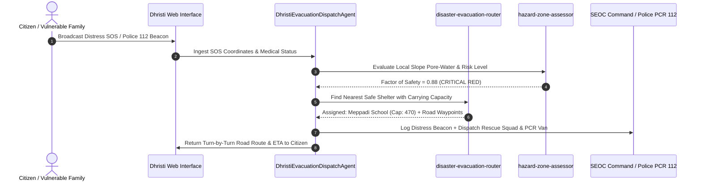

# Dhristi AI Agents & Custom Skills Documentation (`AGENTS_AND_SKILLS.md`)

## 1. Overview

The **Dhristi Disaster Management Platform** incorporates custom autonomous AI agents and modular domain-specific skills designed for high-stakes emergency dispatch, geotechnical risk modeling, and real-time evacuation routing.

---

## 2. Committed Custom Agents

### `DhristiEvacuationDispatchAgent`
- **Location in Repo**: [`.agents/agents/evacuation-dispatch-agent.json`](.agents/agents/evacuation-dispatch-agent.json)
- **Role**: Autonomous SEOC Incident Dispatch & Triage Agent.
- **Capabilities**:
  - Automatically listens to incoming citizen SOS distress streams (`/api/sos`).
  - Prioritizes victims by trapped count, medical assistance requirements, and slope saturation index.
  - Dynamically calculates the nearest safe shelter haven (School, Hospital, Stadium, Government Office) with verified available carrying capacity.
  - Generates turn-by-turn road navigation vectors using OSRM, routing around flooded ravines and landslide debris zones.
  - Triggers Police PCR 112 beacon dispatches with real-time ETA countdowns.

---

## 3. Committed Custom Skills

### 3.1 `disaster-evacuation-router`
- **Location in Repo**: [`.agents/skills/disaster-evacuation-router/SKILL.md`](.agents/skills/disaster-evacuation-router/SKILL.md)
- **Primary Function**: Calculates optimal road corridors and safe shelter allocations avoiding active hazardous Red Zones.
- **Key Modules**:
  - Distance & Elevation Matrix Calculator.
  - OSRM Road Vector Maneuver Generator.
  - Transit Mode Adaptation (`On Foot` vs `4x4 Rescue Vehicle`).
  - Safe Haven Capacity Verifier.

### 3.2 `hazard-zone-assessor`
- **Location in Repo**: [`.agents/skills/hazard-zone-assessor/SKILL.md`](.agents/skills/hazard-zone-assessor/SKILL.md)
- **Primary Function**: Geotechnical IoT sensor telemetry ingestion and slope Factor of Safety ($FS$) classification.
- **Key Modules**:
  - Real-time Rainfall Rate & Soil Saturation Ingestion.
  - Pore-Water Pressure ($u$) Stress Analysis.
  - Infinite Slope Stability Mathematical Evaluator ($FS < 1.0 \implies \text{RED ALERT}$).
  - Multi-Channel Emergency Warning Broadcast Generator.

---

## 4. Execution Workflow

