# Dhristi - System Architecture & Technical Design

## 1. Executive Summary

**Dhristi** is an enterprise-grade, real-time geo-intelligence and disaster resilience platform engineered for the **intelligent identification of hazard-based Red Zones**, **carrying capacity assessment of safe havens** (schools, hospitals, stadiums, and government offices), and **immediate algorithmic relocation routing** for vulnerable habitations.

---

## 2. High-Level Architectural Topology

The application is structured into four distinct architectural tiers:

```mermaid
graph TD
    subgraph Client Layer
        Browser[Client Browser / Mobile PWA]
        VoiceAssistant[Dhristi Vaani AI Voice Engine]
        UnifiedSOS[Unified Emergency SOS Hub]
        GISViewer[3D GIS Leaflet & Satellite Vector Engine]
    end

    subgraph Application & API Layer Next.js App Router
        API_Zones["/api/zones (Hazard Analysis)"]
        API_Shelters["/api/shelters (Carrying Capacity Matrix)"]
        API_Routing["/api/routing/osrm (Road Navigation Vector)"]
        API_SOS["/api/sos (Citizen & Admin Dispatch Stream)"]
        API_Police["/api/police/stations (PCR 112 Beacon)"]
        API_Telemetry["/api/weather/open-meteo (Sensors & Radar)"]
        API_Spatial["/api/spatial/postgis (Bounding Box Engine)"]
    end

    subgraph Core Intelligence & Geospatial Engines
        GeotechEngine[Slope Stability & Factor of Safety Engine]
        OSRM[Open Source Routing Machine Engine]
        PostGIS[PostGIS Spatial Indexing Engine]
        SpeechEngine[Web Speech API Synthesis & Recognition]
        EMDAT[CRED EM-DAT Historical Disaster Registry]
    end

    subgraph State & Storage
        LocalStore[In-Memory / Session State Store]
        GlobalContext[React AppContext + Bilingual I18n Engine]
    end

    Browser --> GlobalContext
    VoiceAssistant --> SpeechEngine
    VoiceAssistant --> GlobalContext
    UnifiedSOS --> API_SOS
    UnifiedSOS --> API_Police
    GISViewer --> API_Zones
    GISViewer --> API_Spatial

    API_Zones --> GeotechEngine
    API_Routing --> OSRM
    API_Shelters --> LocalStore
    API_SOS --> LocalStore
    API_Police --> LocalStore
    API_Telemetry --> EMDAT
```



---

## 3. Technology Stack

| Layer | Technologies & Libraries | Purpose |
| :--- | :--- | :--- |
| **Frontend Framework** | Next.js 14 (App Router), React 18, TypeScript 5.6 | Server-side rendering, static generation, API routes, and client interactivity. |
| **Styling & Design System** | Tailwind CSS 3.4, PostCSS, Lucide-React, Clsx, Tailwind-Merge | Modern disaster-management visual interface with dark/light themes and glassmorphism. |
| **GIS & Geospatial Maps** | Leaflet 1.9, React-Leaflet 4.2, Esri Satellite, Google Maps Hybrid Tiles | Vector tile rendering, hazard overlays, 3D terrain representation, and road routing polylines. |
| **Charts & Predictive Graphs**| Recharts 2.13, Canvas-Confetti | Interactive forecast horizon visualizations, Factor of Safety dials, and celebration confetti. |
| **Speech & Voice AI** | Web Speech API (`SpeechRecognition`, `SpeechSynthesis`) | Dhristi Vaani AI Voice Assistant for bilingual speech command recognition and audio broadcasting. |
| **Internationalization (i18n)**| Custom Context-based Bilingual Engine (`en` / `hi`) | 100% full-site localization across all 25 static and dynamic routes. |
| **CI / CD & Quality** | GitHub Actions, Playwright E2E Testing, ESLint, Prettier | Automated regression testing, report artifact uploading, and Vercel continuous deployment. |

---

## 4. Core Domain Models & Schemas

### 4.1 Hazard Red Zone (`HazardZone`)
```typescript
export interface HazardZone {
  id: string;
  name: string;
  district: string;
  state: string;
  hazardType: 'landslide' | 'flood' | 'earthquake' | 'cyclone';
  riskLevel: 'RED' | 'ORANGE' | 'YELLOW' | 'GREEN';
  coordinates: [number, number];
  affectedPopulation: number;
  slopeGradientDeg: number;
  soilMoisturePct: number;
  poreWaterPressureKPa: number;
  factorOfSafety: number; // FS < 1.0 indicates imminent slope failure
  recommendedAction: 'IMMEDIATE_RELOCATION' | 'PRE_EVACUATION_STANDBY' | 'MONITOR';
}
```

### 4.2 Safe Shelter Havens (`SafeShelter`)
```typescript
export interface SafeShelter {
  id: string;
  name: string;
  category: 'SCHOOL' | 'HOSPITAL' | 'STADIUM' | 'GOVT_OFFICE';
  coordinates: [number, number];
  elevationMeters: number;
  totalCapacity: number;
  currentOccupancy: number;
  availableCapacity: number; // Computed carrying capacity
  amenities: {
    potableWaterLiters: number;
    emergencyRationsDays: number;
    medicalTraumaKits: number;
    backupGensetKw: number;
    helipadAccess: boolean;
  };
  structuralAudit: {
    yearBuilt: number;
    structuralHealthIndex: number; // 0-100%
    lastInspectionDate: string;
    seismicZoneRating: string;
  };
  contactPerson: string;
  contactPhone: string;
}
```

### 4.3 Citizen SOS Beacon & Police PCR Dispatch (`SosAlert`)
```typescript
export interface SosAlert {
  id: string;
  senderName: string;
  senderPhone: string;
  coordinates: [number, number];
  addressDescription: string;
  type: 'CITIZEN_SOS' | 'ADMIN_DISPATCH';
  hazardContext: 'landslide' | 'flood' | 'earthquake' | 'cyclone';
  peopleCount: number;
  medicalAssistanceRequired: boolean;
  notes: string;
  urgency: 'EXTREME' | 'CRITICAL' | 'HIGH';
  status: 'PENDING' | 'DISPATCHED' | 'RESCUED';
  timestamp: string;
  assignedRescueUnit?: string;
  nearestDepotName?: string;
  nearestDepotCoords?: [number, number];
}
```

---

## 5. Algorithmic Workflows & Engine Details

### 5.1 Dynamic Evacuation Road Routing (OSRM Integration)
1. **Coordinate Resolution**: Client resolves user GPS location via HTML5 Geolocation API.
2. **Nearest Shelter Selection**: Haversine + Elevation clearance filter selects optimal shelter with remaining carrying capacity.
3. **OSRM Vector Calculation**: Requests actual road routing avoiding active debris flow corridors and flooded bridges.
4. **Maneuver Generation**: Generates turn-by-turn road instructions with step distance and elevation gain.

### 5.2 Geotechnical Factor of Safety (FS) Evaluation
Slope stability is modeled using the infinite slope equilibrium formula:
$$FS = \frac{c' + (\gamma_{sat} \cdot z - u) \cdot \cos^2\beta \cdot \tan\phi'}{\gamma_{sat} \cdot z \cdot \sin\beta \cdot \cos\beta}$$
- When rainfall exceeds the 24-hour threshold ($50\text{ mm/hr}$) and pore pressure $u > 140\text{ kPa}$, $FS < 1.0$, automatically escalating zone to **CRITICAL RED**.

---

## 6. Security, Resilience & Privacy
- **API Secret Sanitization**: Live API keys and external access credentials are encapsulated server-side within Next.js backend proxy routes.
- **Failover Architecture**: In-memory and localStorage persistence ensures offline continuity during telemetry link disconnects.
- **Accessibility & Compliance**: Semantic HTML5 hierarchy, WCAG 2.1 AA color contrast compliance, and full keyboard navigation.
